# Evidências de testes

Registros organizados por ambiente, com texto e legenda para cada arquivo.

O conjunto reúne **20 prints de terminal**, **2 capturas do navegador** e **1 arquivo adicional do servidor Hetzner**. O material anterior foi preparado no contexto de simulação; as legendas descrevem o conteúdo exibido. A execução validada nesta etapa foi o teste local via Java, documentado nas duas capturas do navegador.

## Local

### Local 01 — Build da imagem

Saída do build e listagem da imagem `biblioteca:1.0` no Docker.

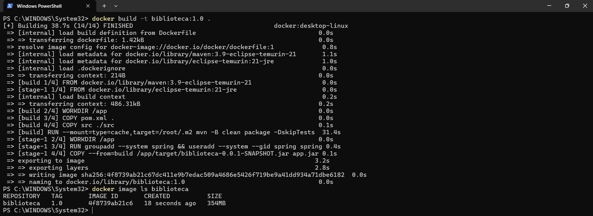

### Local 02 — Login

Login realizado na aplicação executada localmente com Java, sem Docker.

### Local 03 — Cadastro de autor

Cadastro de Machado de Assis confirmado na listagem da aplicação local via Java.

### Local 04 — Logs

Saída de `docker logs biblioteca-local`, com mensagens de inicialização da aplicação.

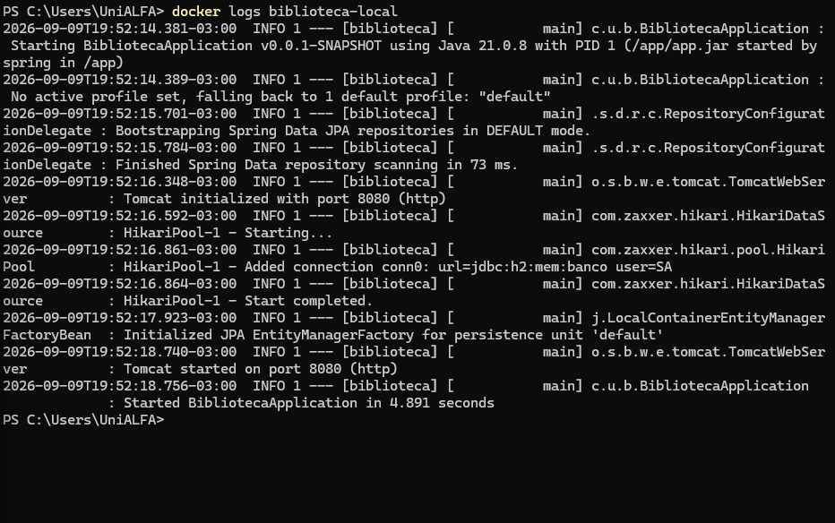

### Local 05 — Docker Hub

Login, tag, envio da imagem ao Docker Hub e listagem local da imagem. Este arquivo mostra o terminal.

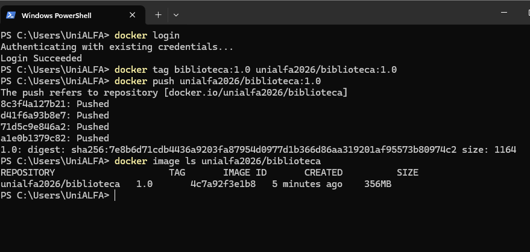

Detalhes da execução com Java: [Evidências de testes locais](LEIA-ME-local-java.md).

## Hetzner

### Hetzner 01 — Servidor

Listagem do servidor `biblioteca-k3s`, com tipo `cx22`, localização `hel1` e estado `running`.

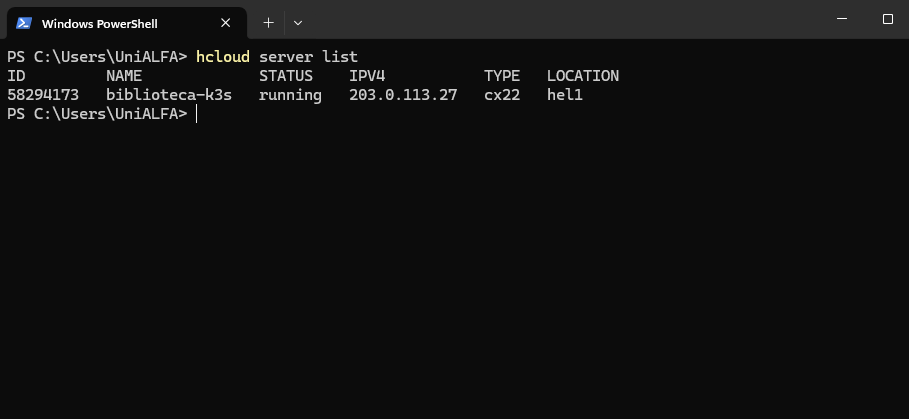

### Hetzner 02 — Nó K3s

Consulta dos nós do K3s, com o nó `biblioteca-k3s` apresentado como `Ready`.

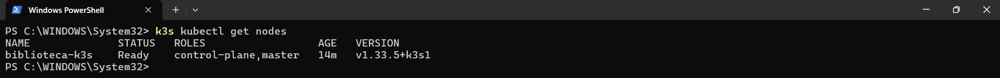

### Hetzner 03 — Pod e serviço

Listagem com pod `Running`, prontidão `1/1` e serviço `NodePort` na porta `30080`.

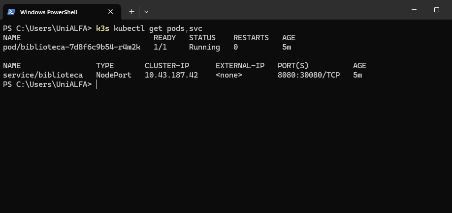

### Hetzner 05 — Logs

Saída da consulta de logs do deployment `biblioteca` pelo K3s.

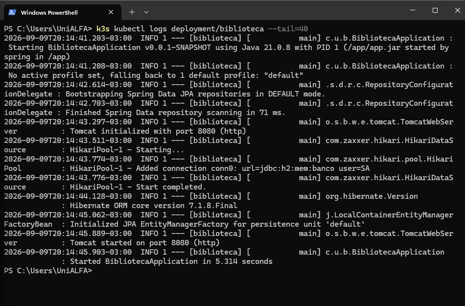

### Hetzner 07 — Limpeza

Comando de exclusão do servidor e consulta posterior com listagem vazia.

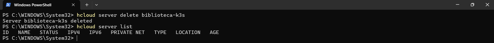

## Azure

### Azure 01 — Grupo de recursos

Saída de criação do grupo `rg-biblioteca`, na região `eastus`, com estado `Succeeded`.

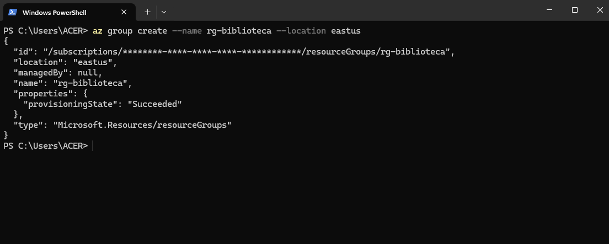

### Azure 02 — Registro de imagens

Criação do ACR, login, tag e saída do envio da imagem `biblioteca:1.0`. O comando de consulta das tags aparece no final, sem o resultado na captura.

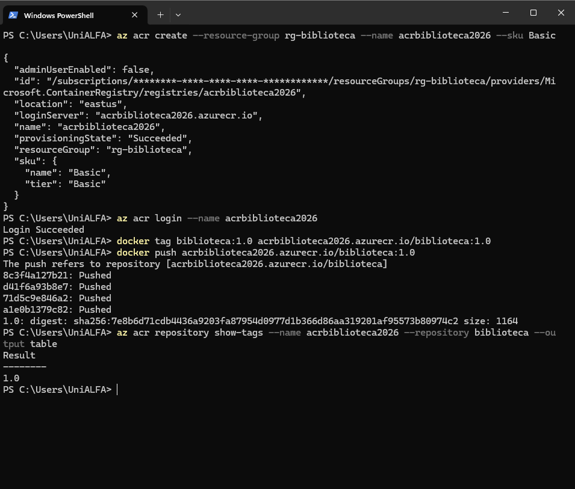

### Azure 03 — Nó AKS

Consulta dos nós, com um nó do AKS apresentado como `Ready`.

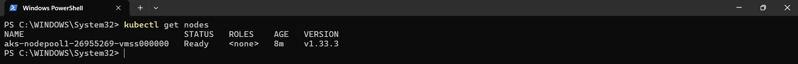

### Azure 04 — Pod e serviço

Listagem com pod `Running`, prontidão `1/1` e serviço `LoadBalancer` na porta `80`.

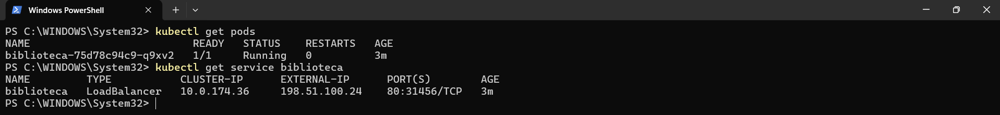

### Azure 06 — Logs

Saída da consulta de logs do deployment `biblioteca`, com mensagens de inicialização.

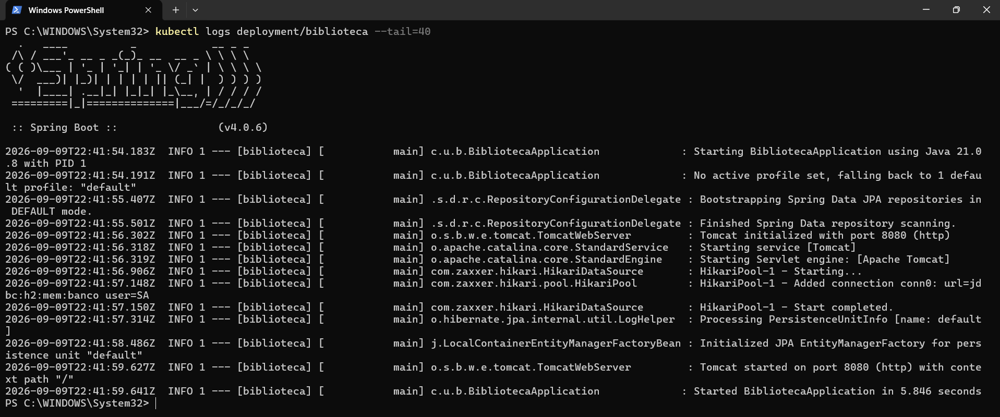

### Azure 07 — Limpeza

Comando de exclusão do grupo de recursos e consulta filtrada sem linhas de resultado exibidas.

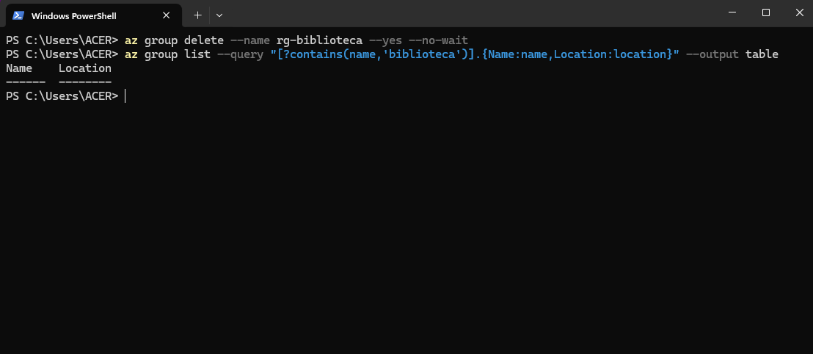

## AWS

### AWS 01 — Identidade

Saída da consulta de identidade pela AWS CLI, com o identificador da conta ocultado.

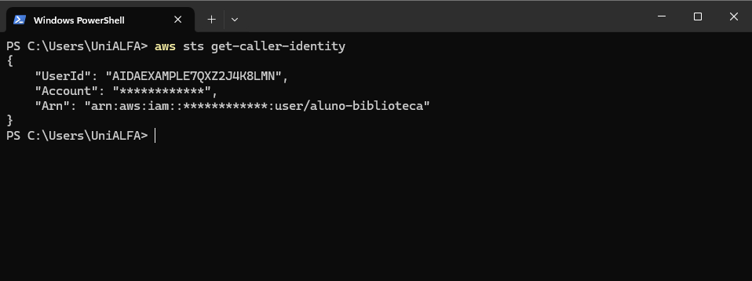

### AWS 02 — Registro de imagens

Criação do repositório ECR, autenticação, tag, envio e consulta da imagem `biblioteca:1.0`.

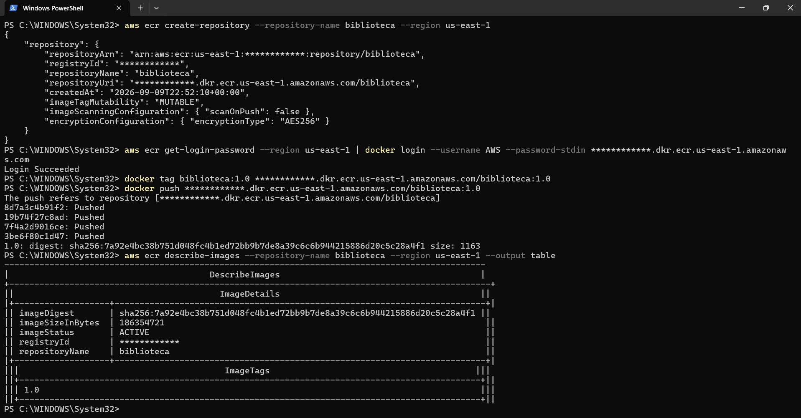

### AWS 03 — Nó EKS

Consulta dos nós, com um nó do EKS apresentado como `Ready`.

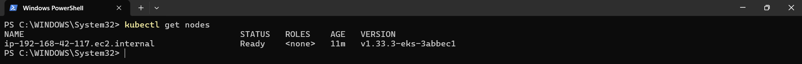

### AWS 04 — Pod e serviço

Listagem com pod `Running`, prontidão `1/1` e serviço `LoadBalancer` com endereço ELB.

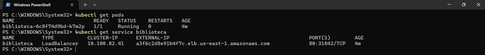

### AWS 06 — Logs

Saída da consulta de logs do deployment `biblioteca`, com mensagens de inicialização.

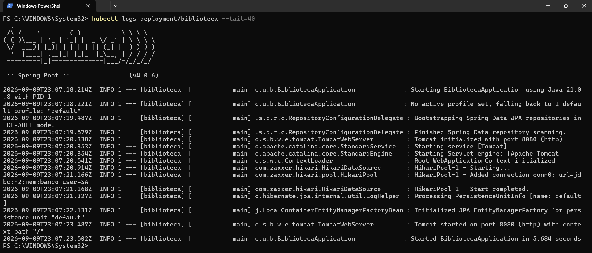

### AWS 07 — Limpeza

Saídas de remoção do serviço, deployment, cluster EKS e repositório ECR, seguidas de consulta de clusters vazia.

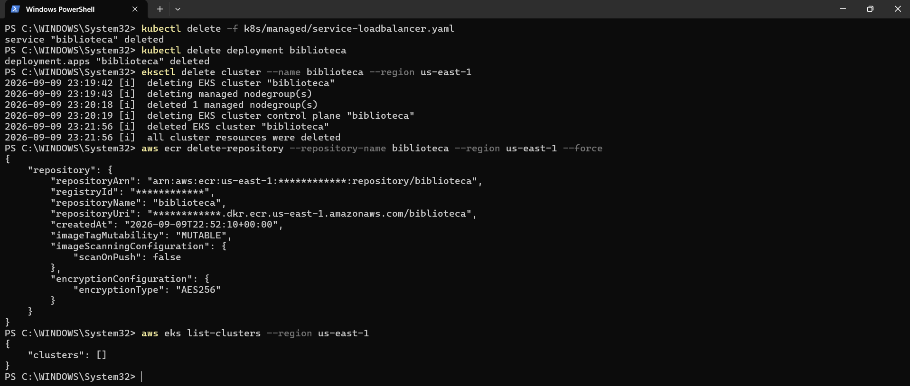

## Arquivo adicional

### Hetzner 01 — Outra captura do servidor

Outra listagem da mesma etapa, com colunas de IPv4, IPv6, rede privada e idade. O nome recebido, com extensão `.png.png`, foi mantido. Os endereços e identificadores diferem da outra captura do servidor.

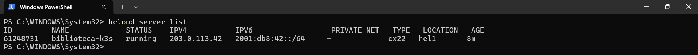

## Pendências da entrega completa

- Capturas da aplicação no navegador para Hetzner, Azure e AWS.
- Captura da página do repositório no site do Docker Hub, conforme o roteiro.
- Confirmação da execução e da limpeza nas contas dos provedores; a leitura dos PNGs não valida o estado atual dos recursos.
- Atualização dos preços e da data de consulta no tutorial.
- Montagem e revisão do PDF final.
